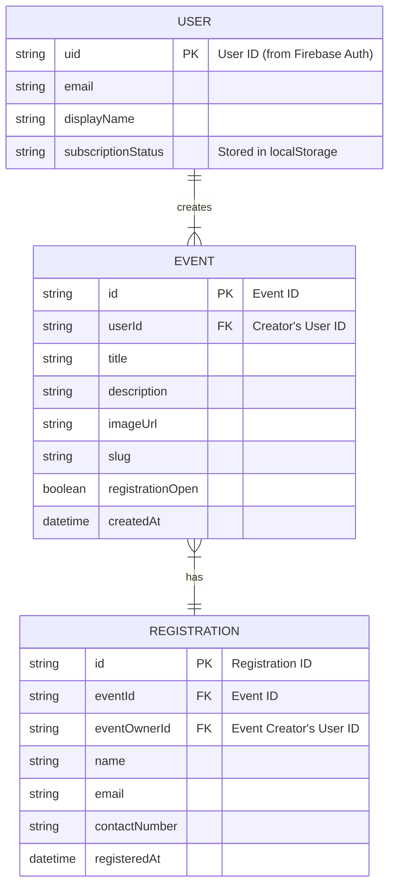

# Evntos - Entity-Relationship Diagram

This diagram outlines the relationships between the main data entities in the Evntos application, primarily how they are structured in Firestore.

**You can view this diagram by pasting the code below into a Mermaid.js editor, such as the one at [https://mermaid.live](https://mermaid.live).**

### Relationships Explained:

1.  **USER to EVENT**:
    *   A `USER` can create one or many `EVENTS`.
    *   Each `EVENT` is created by exactly one `USER`.
    *   This is a **One-to-Many** relationship, linked by `USER.uid` and `EVENT.userId`.

2.  **EVENT to REGISTRATION**:
    *   An `EVENT` can have one or many `REGISTRATIONS`.
    *   Each `REGISTRATION` belongs to exactly one `EVENT`.
    *   This is a **One-to-Many** relationship, linked by `EVENT.id` and `REGISTRATION.eventId`.
